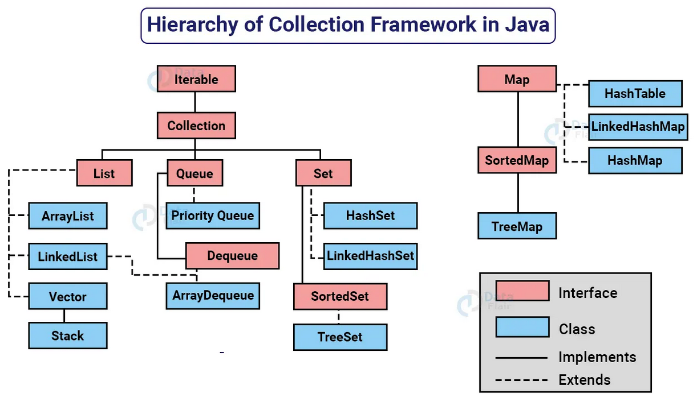

# Projeto: Gerenciador Simples de Produtos

## Descrição
Este projeto foi desenvolvido para revisar conceitos básicos de Collections em Java, aplicando **List**, **Set**, **Queue** e **Map** de maneira simples e objetiva.

Ele simula um sistema básico onde:
- Os produtos são armazenados em **List** (permite duplicatas).
- Produtos únicos são organizados em **Set** (sem duplicatas).
- Processamento de fila de produtos é feito com **Queue** (FIFO - Primeiro a Entrar, Primeiro a Sair).
- Produtos são acessados por código usando **Map** (Chave-Valor).

Este projeto é ideal para revisão rápida de Collections sem código excessivo.

---

## Estrutura do Projeto
```
GerenciadorSimples
 ┣ src
 ┃ ┣ Produto.java
 ┃ ┣ Main.java
 ┣ README.md
 ┣ .gitignore
 ┗ pom.xml
```

---

## Tecnologias Utilizadas
- Java 21
- Collections (`List`, `Set`, `Queue`, `Map`)

---

## Funcionamento do Sistema

O sistema cria automaticamente três produtos e os armazena nas diferentes **Collections**:

### Lista de Produtos (`List` - Permite Duplicatas)
```
Produto{Código='P001', Nome='Notebook'}
Produto{Código='P002', Nome='Mouse'}
Produto{Código='P003', Nome='Teclado'}
```

### Produtos Únicos (`Set` - Sem Duplicatas)
```
Produto{Código='P001', Nome='Notebook'}
Produto{Código='P002', Nome='Mouse'}
Produto{Código='P003', Nome='Teclado'}
```

### Fila de Processamento (`Queue` - Ordem de Entrada)
```
Produto{Código='P001', Nome='Notebook'}
Produto{Código='P002', Nome='Mouse'}
Produto{Código='P003', Nome='Teclado'}
```

### Produtos no Mapa (`Map` - Acesso por Código)
```
Código: P001 -> Produto{Código='P001', Nome='Notebook'}
Código: P002 -> Produto{Código='P002', Nome='Mouse'}
Código: P003 -> Produto{Código='P003', Nome='Teclado'}
```

---

## Collection Framework API
Uma Collection é uma estrutura de dados que serve para agrupar vários elementos em uma única unidade, sendo eles objetos.

As Collections podem ser homogêneas ou heterogêneas, sendo mais comum o uso de coleções homogêneas de um único tipo.

O núcleo das Collections é formado pelas interfaces principais:
- **List** → Lista ordenada que permite duplicatas (`ArrayList`, `LinkedList`).
- **Set** → Conjunto sem duplicatas (`HashSet`, `TreeSet`).
- **Queue** → Fila de processamento (`LinkedList`, `PriorityQueue`).
- **Map** → Estrutura de chave-valor (`HashMap`, `TreeMap`).

Cada uma dessas estruturas resolve diferentes problemas e tem suas particularidades.

---



## Conclusão
Este projeto foi criado para facilitar a **revisão rápida de Collections**, sem código complexo.

Agora é só testar e aprimorar!


