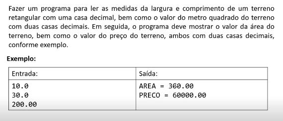
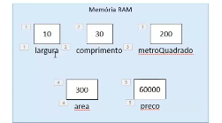

 - primeiro nesse problema vamos ter que calcular a largura do terreno x o comprimento, logo a saida será 300.00
 - segundo preciso fazer area total que é 300 do terrno x o metro quadrado que vai ser 200.00, logo o resultato sera 60000.00

Scanner - é uma classe do Java usada para ler entrada de dados do usuário, como texto e números, através do teclado, arquivos ou outras fontes.
 - Metodos do Scanner

   nextLine()	Lê uma linha completa	scanner.nextLine();
   next()	Lê uma única palavra (até o espaço)	scanner.next();
   nextInt()	Lê um número inteiro	scanner.nextInt();
   nextDouble()	**Lê um número decimal**	scanner.nextDouble();
   nextBoolean()	Lê um valor true ou false	scanner.nextBoolean();

Comando para mostrar na tela -  System.out.println(); 

System.out.printf("AREA= %.2f%n" ,area );

System.out.printf()	Método que imprime texto formatado (printf = print formatado).
"AREA = %.2f%n"	Texto que será impresso, com um espaço reservado para um número decimal (%.2f).
%.2f	Formata um número decimal com duas casas decimais.
%n	Quebra de linha (igual \n, mas mais compatível entre sistemas).
area	Variável cujo valor será inserido no %f.